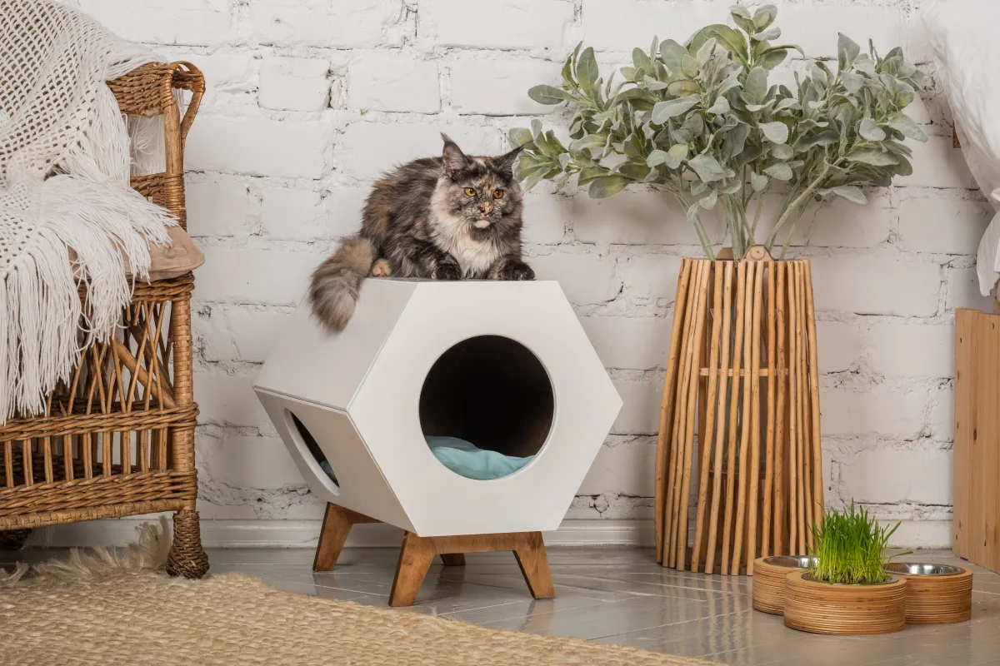
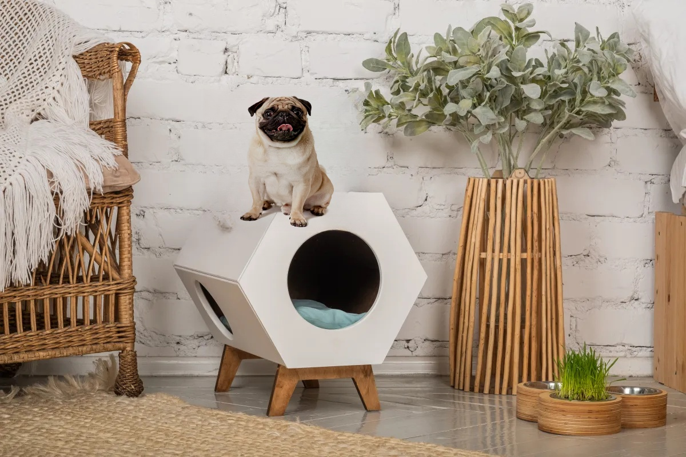
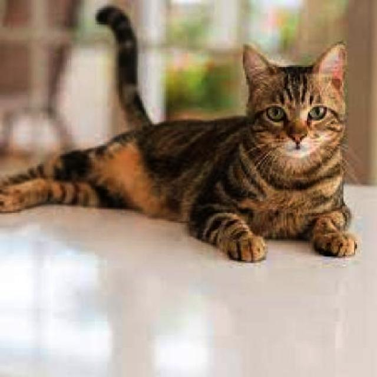
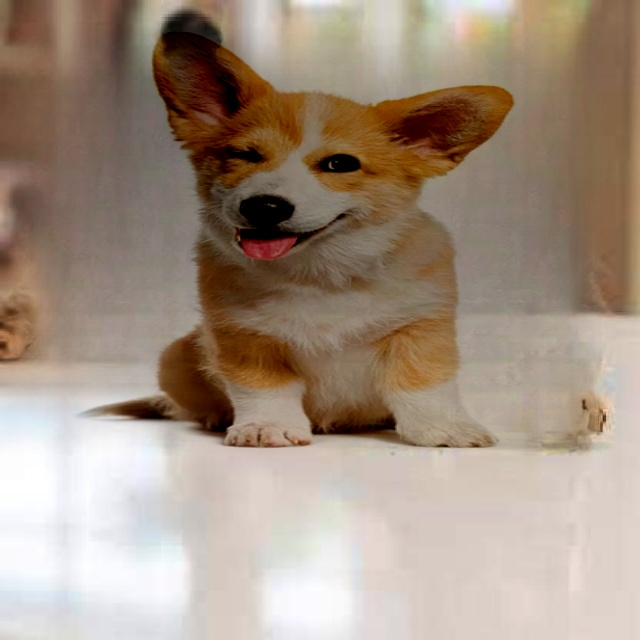

# cat2dog-detect-and-replace 

This project implements a flexible end-to-end pipeline that detects any object supported by a YOLO model and replaces it with a pre-defined image.

Specifically, this project implements an end-to-end pipeline that detects a cat in an image and replaces it with a pre-defined image of a dog using object detection and image manipulation techniques.

The project also uses the LAMA model and other image manipulation techniques to ensure seamless integration of the replacement object into the image.


## Table of Contents
- [Features](#features)
- [Installation](#installation)
- [Configuration](#configuration)
- [Usage](#usage)
- [Examples](#examples)
- [License](#license)

## Features
- **Object Detection**: Detects objects in images using a pre-trained YOLO model.
- **Image Replacement**: Replaces detected objects with a user-specified image using advanced image manipulation techniques, including the LAMA model.
- **End-to-End Pipeline**: A complete system that detects objects and replaces them seamlessly in a single function call.


## Installation
Provide instructions on how to install the project, dependencies, and requirements.

```bash
# Clone the repository
git clone https://github.com/3horta/cat2dog-detect-and-replace.git

# Change directory
cd project-cat2dog-detect-and-replace

# Install dependencies
pip install -r requirements.txt
```

## Configuration

- **YOLO Model**: Ensure the pre-trained YOLO model is set up properly. Specify the image for object detection.
- **LAMA Model**: Ensure that the LAMA model is properly set up in your environment. This will be used to perform inpainting and other advanced image manipulations.
- **Object Classes**: Ensure that the object type you want to detect is part of the YOLO class list.
- **Replacement Image**: Set the path to the image you want to use for replacing the detected object.


## Usage

```python
from opject_replacer import ObjectReplacer

# Example usage
if __name__ == "__main__":
    
    # Define the pre-trained model (YOLOv5 in this case)
    model_name = 'yolov5s'  # Update the model name as needed
    replacer = ObjectReplacer(model_name)

    # Path to the replacement image (in this case, a dog image)
    replacement_image_path = 'dog_images/pug.png'  # Update to your replacement image path

    # Path to the input image that contains the object (a cat in this case)
    image_paths = 'test_data/gato.jpg'

    # Specify the object class to detect and replace (e.g., 'cat')
    target_class = ['cat']  # You can replace this with other classes as supported by YOLO

    # Run the replacement
    replacer(image_paths, target_class, replacement_image_path)

```

## Examples

<table>
  <tr>
    <td></td>
    <td></td>
  </tr>
  <tr>
    <td></td>
    <td></td>
  </tr>
</table>

## License

MIT License